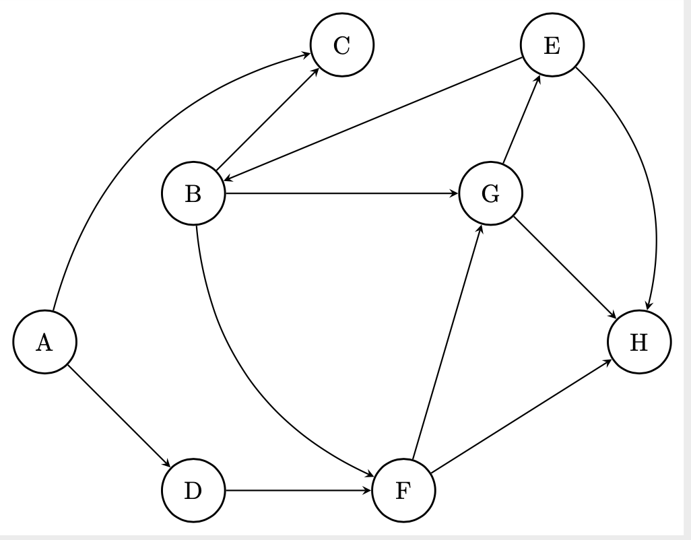

# PageRank

El algoritmo de [PageRank](http://ilpubs.stanford.edu:8090/422/1/1999-66.pdf), creado por Sergey Brin y
Larry Page, nos permite definir un ranking, o importancia, de los distintos vértices dentro de una red.
Esto es similar a lo que busca obtener [la centralidad de un grafo](centralidad.md), si bien distintas
centralidades pueden servir para objetivos diferentes. Este algoritmo fue el inicialmente utilizado
por el _engine_ de Google para rankear sus búsquedas de páginas webs.

Éste algoritmo implica calcular:

$$
\text{PR}\left(p_i\right) = \frac{1-d}{N} + d \sum_{p_j \in M\left(p_i\right)}
\frac{\text{PR}\left(p_j\right)}{L\left(p_j\right)}
$$

Donde:
* $$\text{PR}\left(p_i\right)$$: Pagerank del artículo (vértice) $$p_i$$ que se está queriendo calcular.
* $$d$$: coeficiente de amortiguación (valor entre 0 y 1). Representa la probabilidad de seguir yendo de
página en página utilizando links, en vez de escribir una URL en el browser.
* $$N$$: cantidad de artículos (vértices). **Ciudado**: En el paper original no aparece este término, que
es muy importante para que el valor del pagerank se mantenga entre 0 y 1. La explicación de éste error se
encuentra en [el artículo de Wikipedia en inglés](https://en.wikipedia.org/wiki/PageRank) (en el artículo
en español mantiene el error).
* $$\text{PR}\left(p_j\right)$$: pagerank del artículo $$p_j$$, donde $$p_j$$ sea un artículo que tenga un
link hacia $$p_i$$. Se consideran todos los artículos que tengan un link hacia $$p_i$$. Es importante notar
que cuando se trata de un grafo dirigido, estamos hablando de las aristas de entrada a $$p_i$$, no las de
salida.
* $$L\left(p_j\right)$$: cantidad de links que tiene el artículo $$j$$ (mismo que
$$\text{PR}\left(p_j\right)$$).

El valor del Pagerank puede verse intuitivamente como la probabilidad de aparecer en un articulo navegando
a través de internet, ya sea yendo a través de los links (segundo término) o accediendo de forma aleatoria
(primer término).

Es necesario realizar varias iteraciones de este algoritmo para que termine por converger y que la
actualización sea asincrónica (todos tomando los valores de la iteración anterior).

## PageRank Personalizado

Se puede ver a PageRank como un gigantesco [Random Walk](random_walks.md), de algún largo arbitrario y empezando desde cualquier vértice, contando la cantidad de apariciones.

Otra utilidad de PageRank es la de poder encontrar qué vértices son más similares a otros. Esto es, hacer un Random Walk que comience en dichos vértices de interés (que puede ser uno sólo, si queremos ver los vértices similares a uno en particular), tomando un largo arbitrario. Siempre comenzando desde ese (o esos) vértices. En caso de ser más de uno, se elige de forma aleatoria desde cuál comenzar. Los vértices que más veces aparezcan, serán los más similares. 
Ahora bien, hay que tener en cuenta el grado de los vértices (en caso de dirigido, grado de salida). No nos 
puede dar lo mismo movernos de un vértice _x_ a un vértice _y_, donde _x_ sólo tenía como adyacente a _y_, que si _x_ tiene muchos adyacentes. Pensemos que este último ejemplo quiere decir que _x_ referencia a muchísimas páginas (en el contexto original de pagerank), por lo que cada una debería "importar menos". 

Entonces, si bien comenzamos con un valor de 1 el recorrido, lo que vamos a hacer es darle al siguiente vértice al que nos movamos el valor que tenemos por ahora, multiplicado por $$\frac{1}{d_{out}}(x)$$ (con $$d_out(x)$$ el grado de salida de _x_, que en el caso de un grafo no dirigido es directamente el grado).

Por ejemplo, en el siguiente grafo: 

{:width="60%"}

Si empezamos en `G` (no le asignamos nada por empezar allí) un recorrido de largo 5, un recorrido posible sería `G -> E -> B -> G -> E -> H`. Entonces, comenzamos en `G` con un valor de PageRank de 1 a transferir. Como `G` tiene 2 adyacentes, va a transferir 0.5. En este caso, se los transmite a `E`. `E` también tiene 2 adyacentes, por lo que transmite 0.25 (a `B` en este caso). `B` también tiene 2 adyacentes, por lo que transmite 0.125 al siguiente, `G`. `G` (nuevamente) tiene 2 adyacente, por lo que transmite 0.0625 a `E`, que tiene 2 adyacentes por lo que le transmite 0.03125 a `H`. Entonces, al PageRank que se vienen acumulando se le sumaría: `E: 0.5625; B: 0.25; G: 0.125; H: 0.03125` (Si bien `G` seguramente luego lo descartemos).

Por esto mismo es importante tener en cuenta que hay que hacer varios Random Walks (y de un largo mayor que el del ejemplo puesto aquí) para que esto tenga un resultado correcto. 

Este es por ejemplo el algoritmo que ha usado durante mucho tiempo Twitter para recomendar usuarios para seguir. 
